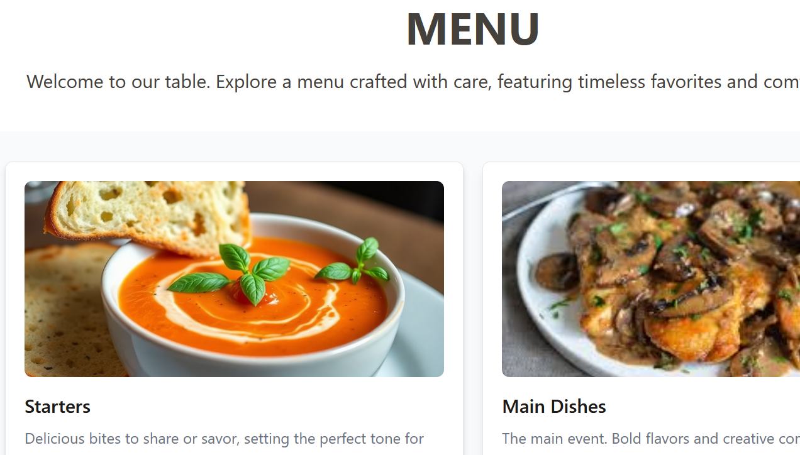
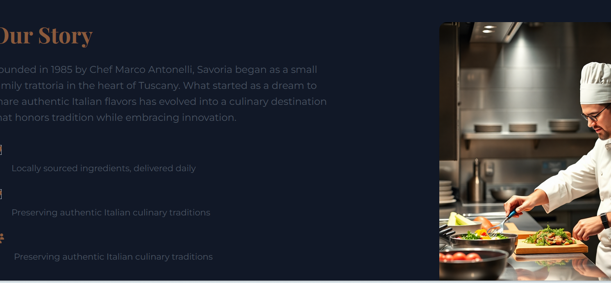

# Savoria Hotel Website 🍽️

A modern, responsive restaurant website built with React and Vite, featuring elegant design, dark/light theme toggle, and interactive user experience.

## 🌐 Live Demo
https://resonant-begonia-82a549.netlify.app/


## TEAM MEMBERS INCLUDE:
Edmond Oketch-UI/UX 
TENBITE DANIEL-FULL-STACK 
NTOITI FIDELIS-FULL-STACK
IAN KARANJA-GEN AI
KARANJA KARIUKI-GEN AI

## 📸 Screenshots

### Light Mode

![Menu Section Light]----------
### Dark Mode  
![Homepage Dark Mode] -------------------------

### Key Features
![Reservation Form]---------------
![Chat Support]----------------------[Chat bot](screenshots/image4.png)


## 🚀 Project Overview

Savoria is a sophisticated restaurant website that combines modern web technologies with elegant design to create an immersive dining experience online. The website features a complete restaurant showcase including menu browsing, reservation system, and customer support chat.

### 🎯 Purpose
- Showcase restaurant brand and atmosphere
- Enable online table reservations
- Display menu items with detailed descriptions
- Provide customer support through integrated chat
- Ensure accessibility across all devices and themes

## ✨ Main Features

### 🎨 **Theme System**
- **Light/Dark Mode Toggle**: Seamless switching between themes
- **Persistent Theme**: User preference saved in localStorage
- **Smooth Transitions**: Animated theme changes across all components
- **System Preference Detection**: Automatically detects user's system theme

### 🧭 **Navigation & UX**
- **Sticky Header**: Fixed navigation with smooth scrolling
- **Single Page Application**: Smooth section transitions
- **Responsive Menu Dropdown**: Interactive menu categories
- **Smooth Scroll**: Anchor-based navigation to page sections

### 🍽️ **Menu & Dining**
- **Signature Dishes Section**: Featured menu items showcase
- **Category-based Menu**: Organized sections (Starters, Main Dishes, Drinks, Desserts)
- **Individual Menu Pages**: Detailed view for each category
- **Interactive Cards**: Hover effects and smooth animations

### 📅 **Reservation System**
- **Complete Booking Form**: Date, time, guest count, and special requests
- **Form Validation**: Real-time validation with error handling
- **Local Storage**: Reservation history tracking
- **Responsive Design**: Optimized for all screen sizes

### 💬 **Customer Support**
- **Integrated Chatbot**: Real-time customer support
- **Floating Chat Button**: Always accessible support
- **Scroll Prevention**: Modal behavior during chat interaction

### 📱 **Responsive Design**
- **Mobile-First Approach**: Optimized for mobile devices
- **Tablet & Desktop**: Responsive layouts for all screen sizes
- **Touch-Friendly**: Interactive elements optimized for touch

### 🎬 **Interactive Elements**
- **Hero Carousel**: Image slideshow with navigation controls
- **Typewriter Effect**: Animated text for brand name
- **Hover Animations**: Interactive cards and buttons
- **Loading States**: Smooth transitions and feedback

## 🛠️ Technologies Used

### **Frontend Framework**
- **React 18** - Modern UI library with hooks
- **Vite** - Fast build tool and development server

### **Styling & UI**
- **Tailwind CSS** - Utility-first CSS framework
- **Custom CSS** - Additional styling for animations
- **Google Fonts** - Playfair Display & Montserrat typography

### **Routing & Navigation**
- **React Router DOM** - Single-page application routing
- **Smooth Scrolling** - Native browser scroll behavior

### **State Management**
- **React Hooks** - useState, useEffect, useRef
- **Local Storage** - Theme and reservation persistence

### **Development Tools**
- **npm** - Package management
- **Git** - Version control with semantic commits

### **Assets & Media**
- **Custom Images** - Restaurant photography and branding
- **SVG Icons** - Scalable vector graphics
- **Font Awesome** - Icon library for UI elements

## 📁 Project Structure

```
SavoriaHotel/
├── public/
│   └── vite.svg
├── src/
│   ├── components/
│   │   ├── Header.jsx          # Navigation with theme toggle
│   │   ├── Hero.jsx            # Carousel and typewriter effect
│   │   ├── Story.jsx           # Restaurant story section
│   │   ├── Menu.jsx            # Menu showcase component
│   │   ├── Form.jsx            # Reservation form
│   │   ├── Footer.jsx          # Footer with contact info
│   │   └── ChatPopup.jsx       # Customer support chat
│   ├── pages/
│   │   ├── Starterspage.jsx    # Starters menu page
│   │   ├── MainDishesPage.jsx  # Main dishes menu page
│   │   ├── DrinksPage.jsx      # Drinks menu page
│   │   └── DessertsPage.jsx    # Desserts menu page
│   ├── Data/
│   │   └── dishes.js           # Menu data and descriptions
│   ├── assets/
│   │   └── images/             # Restaurant images and logos
│   ├── App.jsx                 # Main application component
│   ├── main.jsx               # Application entry point
│   └── index.css              # Global styles and Tailwind
├── package.json
├── tailwind.config.js
├── vite.config.js
└── README.md
```

## 🚀 Getting Started

### Prerequisites
- **Node.js** (version 16 or higher)
- **npm** (comes with Node.js)

### Installation

1. **Clone the repository**
   bash
   git clone https://github.com/yourusername/savoria-restaurant.git
   cd savoria-restaurant
   

2. **Install dependencies**
   bash
   npm install
   

3. **Start development server**
   bash
   npm run dev
   

4. **Open in browser**
   
   http://localhost:5173

### Build for Production

1. **Create production build**
   bash
   npm run build
   

2. **Preview production build**
   bash
   npm run preview
   

3. **Deploy the `dist/` folder** to your hosting service

## 📱 Responsive Breakpoints

- **Mobile**: 320px - 768px
- **Tablet**: 768px - 1024px  
- **Desktop**: 1024px and above

## 🎨 Design Features


### **Typography**
- **Headings**: Playfair Display (serif)
- **Body Text**: Montserrat (sans-serif)
- **Interactive Elements**: Inter (sans-serif)

## 🔧 Development Workflow

### **Git Workflow**
- **Semantic Commits**: Clear, descriptive commit messages
- **Feature Branches**: Separate branches for new features
- **Pull Requests**: Code review process before merging


## 🤝 Contributing

1. Fork the repository
2. Create a feature branch (`git checkout -b feature/amazing-feature`)
3. Commit your changes (`git commit -m 'feat: add amazing feature'`)
4. Push to the branch (`git push origin feature/amazing-feature`)
5. Open a Pull Request
6. Ask for a review of the pull request
7. The pull request is merged if there are no conflicts with the main branch


